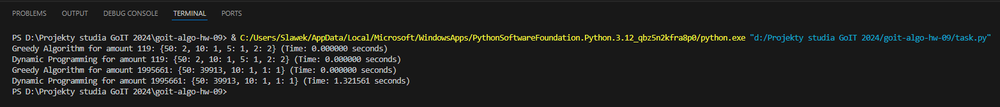

# goit-algo-hw-09
TASK DESCRIPTION

You need to write two functions for the cash register system that gives change to the customer:
The function of the greedy algorithm find_coins_greedy. This function should take the money given to the customer and return a dictionary with the number of coins of each denomination used to make up the amount. For example, for 113, this would be the dictionary {50: 2, 10: 1, 2: 1, 1: 1}. The algorithm should be greedy, i.e., choose the most available coin denominations first.
Dynamic programming function find_min_coins. This function should also take an amount of change but use a dynamic programming method to find the minimum number of coins needed to generate that amount. The function should return a dictionary with the coin denominations and the number of coins needed to reach the given amount most efficiently. For example, for the sum of 113, this would be the dictionary {1: 1, 2: 1, 10: 1, 50: 2}

Compare the performance of the greedy and dynamic programming algorithms based on their execution time or O large and pay attention to their performance for large sums. Highlight how they handle large amounts and why one algorithm may be more efficient in certain situations. Include your findings in the readme.md file for homework.

Greedy Algorithms and Dynamic Programming

Explanation and comparison of the considered algorithms

Greedy algorithm

Time complexity: O(n), where n is the number of coin denominations.
Spatial complexity: O(1), only a few variables for denominations and result dictionary.
Performance: Very fast and efficient in most practical applications. It makes decisions locally at every step, choosing the largest coin possible. However, it does not always provide an optimal solution for all coin systems (it works perfectly for standard coin systems such as the one used in this example).

Dynamic programming

Time complexity: O(n * amount), where n is the number of coin denominations and amount is the change amount.
Space Complexity: O(quantity), due to the table used to store the minimum number of coins for each amount.
Efficiency: Guarantees to find the optimal solution (minimum number of coins), but at the cost of greater time and space complexity. This method is more suitable when coin denominations do not follow a simple pattern that allows the greedy algorithm to work optimally.

CONCLUSION

Greedy algorithm: fast and simple, but does not always provide an optimal solution for coins with non-standard denominations.
Dynamic programming: slower and more resource-intensive, but guarantees an optimal solution.

For large amounts, the greedy algorithm works much faster, but may not always be optimal. The dynamic programming approach, although slower, ensures the use of a minimum number of coins, making them more reliable in scenarios with complex coin systems.

Example Performance Comparison

